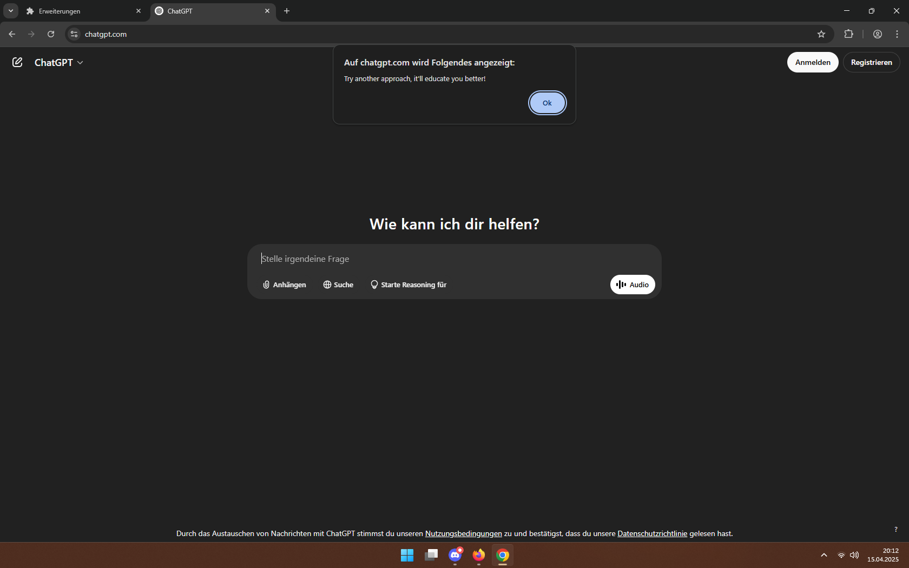
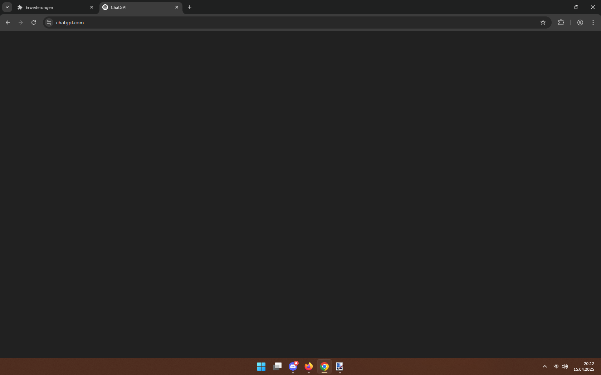
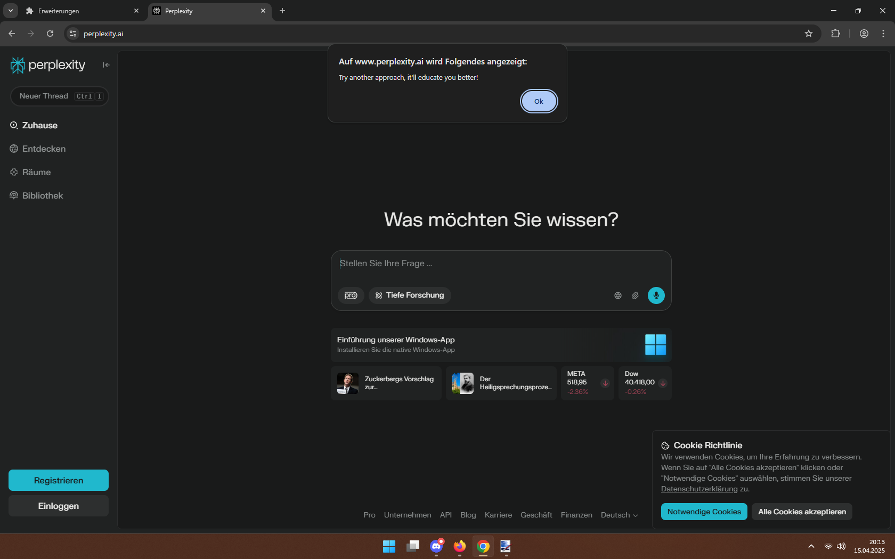
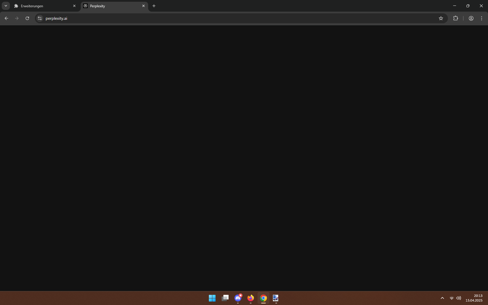
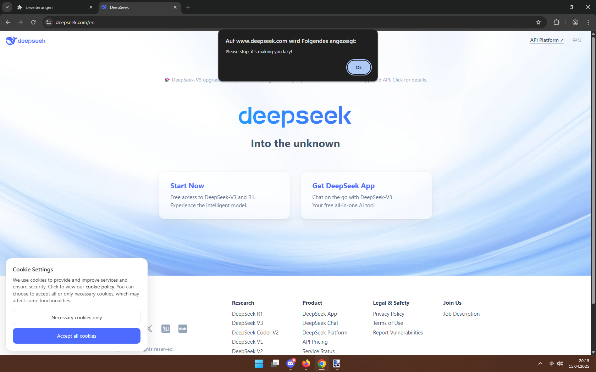

# AI.Q.Low

> The browser extension you didn't know you needed (and you still don't, trust me).

## Disclaimer

The whole purpose of this browser extension is to be a **joke**. Don't take it too seriously. 

This is **not** useful, will likely **not** help you in any meaningful way, and has **nothing** to do with actual AI.  

However, if you think you're relying too much on *tools* like ChatGPT, Gemini or whatever else is coming up, this might be for you.

## What is AI.Q.Low?

AI.Q.Low is a minimal browser extension that *should* work in all major browsers.  

AI.Q.Low does two very simple things:

* It will judge you if you visit any of the recognized AI websites.
* It will delete the body of those websites once you accept the judgment.

## Screenshots

## List of recognized AI websites (as of v0.1.0)

* Claude
* ChatGPT
* Microsoft Copilot
* Perplexity
* DeepSeek
* Gemini

## How does it work?

Every browser extension needs a [manifest.json](./manifest.json) file.  

Part of this file is a collection of URLs (called `matches`) that trigger the extension when you visit any of these sites.  

AI.Q.Low uses those matches to activate when a user visits any of the recognized AI websites, then proceeds to show an `alert` to the user before calling `document.body.remove()` removing access to your precious AI friend with no hope of return (you can reload the page and suffer another time).

## Installation

> AI.Q.Low is **not** available in the Chrome Web Store or the Firefox Add-Ons Website. It must be loaded manually. As a result, AI.Q.Low will only persist for a single browser session. If you're missing your AI friend, you can close the *window* and open up a new one.

### Chrome

* Open `chrome://extensions/` in the address bar.
* Enable `Developer mode` (top-right corner).
* Click `Load unpacked` and select the *AI.Q.Low* folder.

### Firefox

* Open `about:debugging` in the address bar.
* Click `This Firefox`.
* Navigate to the *AI.Q.Low* folder and select the `manifest.json`.

The steps for browsers not included in this list are likely similar.

## Contributing and Bug Reports

AI.Q.Low is a joke project, but if you'd like any other URLs to be included, find any bugs or have ideas to improve the project, feel free to open an issue or send a pull request!

When sending bug reports, please describe the problem in detail and include any error messages, if applicable.

## License

AI.Q.Low is licensed under the [MIT License](./LICENSE.md).

## Warning

This **will** prevent you from using any of the AI websites specified in the [manifest.json](./manifest.json) (see `matches`) file after enabling the browser extension. You can either disable it the same way you enabled it, or you can close the browser window and open up a new one.

<!-- Thank you for checking out AI.Q.Low! -->
<!-- Although it's purely a joke, this is my very first public repository. and quite some effort went into creating this README -->
<!-- Having someone actually investigate the files means a lot to me. -->
<!-- Enjoy your day! -->

